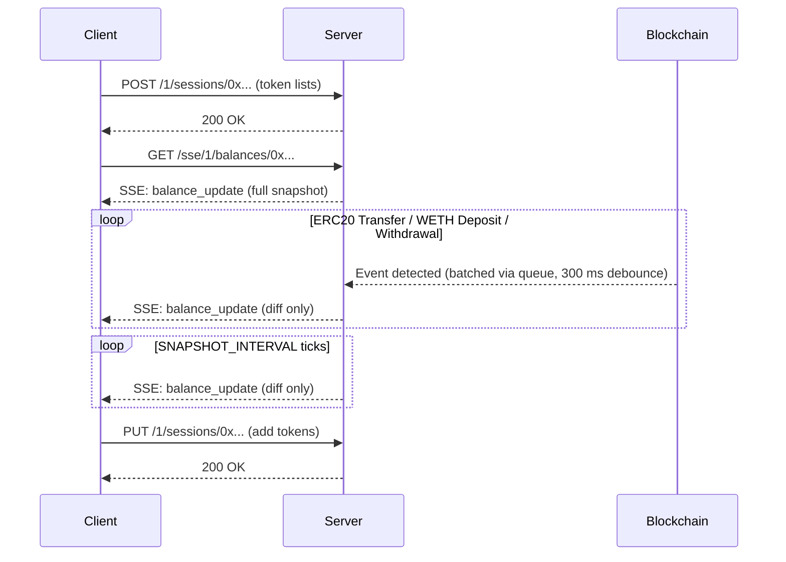
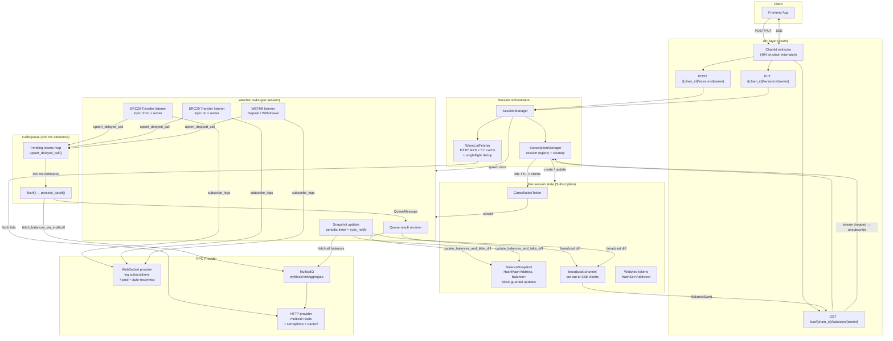

# Token Balances Watcher

Real-time ERC20 + native token balance tracking service for EVM chains, designed
to back the CoW Swap frontend without each user blowing through their wallet's
RPC rate limits.

The service is **chain-scoped**: one process serves exactly one network. Multi-chain
coverage is achieved by running N replicas (one per chain) behind a path-based
ingress — see [Deployment model](#deployment-model).

## Features

- Real-time balance updates via **Server-Sent Events (SSE)**
- **Multicall3** for efficient batch balance reads (`balanceOf` + native `getEthBalance`
  in a single call)
- **WebSocket subscriptions** for ERC20 `Transfer` events + WETH9 `Deposit`/`Withdrawal`
  events, with automatic reconnect and resubscription
- **Event batching** via a 300 ms debounce queue — bursts of transfers collapse
  into a single multicall
- **Block-aware diffing** — stale updates can't overwrite fresher ones
- **Diff-only SSE events** after the initial snapshot (only changed balances are sent)
- **Shared subscriptions** — N SSE clients watching the same wallet pay for one
  set of background watchers
- **Token-list caching** with 5 h TTL + concurrent-request deduplication
- **Graceful shutdown** — `SIGTERM` cancels every spawned task via
  `CancellationToken`; in-flight work is awaited (up to 10 s) before exit
- **Prometheus metrics** exposed at `/metrics`

## Supported chains

`NETWORK` is set per instance to one of the chain ids below. The list matches
the EVM chains supported by the CoW SDK (`@cowprotocol/sdk-config` → `EvmChains`).

| Network | Chain id |
|---------|----------|
| Ethereum mainnet | `1` |
| BNB Smart Chain | `56` |
| Gnosis Chain | `100` |
| Polygon | `137` |
| Base | `8453` |
| Plasma | `9745` |
| Arbitrum One | `42161` |
| Avalanche | `43114` |
| Ink | `57073` |
| Linea | `59144` |
| Sepolia testnet | `11155111` |

RPC endpoints are configured per instance via `RPC_HTTP_URL` and `RPC_WS_URL`
environment variables. In production (CoW infrastructure), these point to
cluster-local RPC proxies (e.g. `http://mainnet-proxy.rpc-nodes.svc.cluster.local`).
For local development, any RPC provider (Alchemy, Infura, etc.) can be used.

## API

All API routes carry `{chain_id}` so the ingress can route by URL. Each instance
rejects requests addressed to a chain other than its configured `NETWORK` with
`404 Not Found` (enforced via the `ChainId` axum extractor).

### `POST /{chain_id}/sessions/{owner}` — create session

Must be called before opening the SSE stream. Spawns the per-session watchers
(snapshot updater, ERC20 listeners, WETH9 listener, queue receiver).

```bash
curl -X POST http://localhost:8080/1/sessions/0xd8dA6BF26964aF9D7eEd9e03E53415D37aA96045 \
     -H 'Content-Type: application/json' \
     -d '{
       "tokensListsUrls": ["https://tokens.coingecko.com/uniswap/all.json"],
       "customTokens": ["0xdAC17F958D2ee523a2206206994597C13D831ec7"]
     }'
```

| Status | Meaning |
|---|---|
| `200 OK` | Session created (or extended if it already existed) |
| `400 Bad Request` | Both `tokensListsUrls` and `customTokens` empty, or token limit exceeded |
| `404 Not Found` | `chain_id` does not match this instance's `NETWORK` |

### `PUT /{chain_id}/sessions/{owner}` — extend session

Adds more tokens to an existing session.

```bash
curl -X PUT http://localhost:8080/1/sessions/0xd8dA6BF26964aF9D7eEd9e03E53415D37aA96045 \
     -H 'Content-Type: application/json' \
     -d '{ "customTokens": ["0xNewTokenAddress"] }'
```

| Status | Meaning |
|---|---|
| `200 OK` | Tokens added |
| `400 Bad Request` | Body empty or token limit exceeded |
| `404 Not Found` | `chain_id` mismatch or session does not exist |

### `GET /sse/{chain_id}/balances/{owner}` — balance stream

Long-lived SSE stream. The first event is the full snapshot for all watched
tokens; every subsequent event is **only the changed balances** (a diff).

```bash
curl -N http://localhost:8080/sse/1/balances/0xd8dA6BF26964aF9D7eEd9e03E53415D37aA96045
```

```
event: balance_update
data: {"balances":{"0xToken1...":"1000000","0xToken2...":"500000"}}

event: error
data: {"code":503,"message":"WebSocket connection lost permanently"}
```

| Event | Meaning |
|---|---|
| `balance_update` | First message = full snapshot. All others = diffs only. Periodic snapshot refreshes also emit diffs. |
| `error` | Terminal error (RPC exhausted, server shutting down, ...). Client should reconnect. |

### `GET /health` — health probe

Active synthetic probe. Calls `eth_blockNumber` on the HTTP RPC provider; returns
`200 OK` if the upstream node responds, `503 Service Unavailable` otherwise.

Used by Kubernetes `readinessProbe` + `livenessProbe`. No internal retries —
transient failures are absorbed by `failureThreshold` at the probe level (see
`.github/k8s/deployment.yaml`).

```bash
curl -i http://localhost:8080/health
```

### `GET /metrics` — Prometheus

Standard scrape endpoint, exposes counters / gauges / histograms for sessions,
SSE connections, multicall latency, WS reconnects, broadcast lag, and more.
All handles are pre-registered at startup via `src/metrics.rs` (typed
`Counter` / `Gauge` / `Histogram` struct — no string-based macros at call
sites).

### Error response shape

All `4xx`/`5xx` API responses use the same JSON envelope:

```json
{ "code": 400, "message": "Bad request: tokens_lists_urls && custom_tokens are empty" }
```

## Usage flow



## Architecture



## Deployment model

Each chain runs as its own process. Benefits over the old multi-chain-in-one-process
model:

- **Fault isolation** — a Polygon hardfork or RPC outage on one chain can't
  exhaust resources or fail readiness on the others.
- **Independent rollouts** — version one chain at a time.
- **Per-chain config** — separate RPC endpoints, rate-limit tiers, resource
  requests, Prometheus pod labels.

### Kubernetes (production)

Manifests live in `.github/k8s/` and are rendered per chain by
`.github/workflows/deploy.yml`. One `Deployment` + `Service` per chain, one
`Ingress` routes `/<chain_id>/...` and `/sse/<chain_id>/...` to the matching
service. Adding a chain:

1. Add `"NAME:chain_id"` to the `for entry in ...` loop in `.github/workflows/deploy.yml`.
2. Add two `path:` blocks (`/<chain_id>/` and `/sse/<chain_id>/`) to
   `.github/k8s/ingress.yaml`.
3. Make sure the chain is supported by `EvmNetwork::TryFrom<u64>`
   (`src/domain/evm_network.rs`).

### docker-compose (local dev)

`docker-compose.yml` mirrors the production layout: one Traefik service in front
of `balances-watcher-eth`, `-arb`, `-sepolia`. All three reachable through a
single host port (`localhost:4000`) using the same URL shape as production.

```bash
# RPC URLs are set per service in docker-compose.yml.
# By default they fall back to Alchemy via ALCHEMY_API_KEY from .env.
# Override per chain: ETH_RPC_HTTP_URL, ARB_RPC_HTTP_URL, etc.
docker-compose up -d --build

# Traefik dashboard for routing introspection
open http://localhost:8081

curl -X POST http://localhost:4000/1/sessions/0xd8dA... -d '{...}'
curl -N      http://localhost:4000/sse/1/balances/0xd8dA...
```

## Environment variables

| Variable | Description | Default |
|----------|-------------|---------|
| `NETWORK` | **Required.** Chain id this instance serves. Validated at args-parse time via `EvmNetwork::FromStr`. | — |
| `RPC_HTTP_URL` | **Required.** HTTP RPC endpoint (e.g. `https://eth-mainnet.g.alchemy.com/v2/KEY` or `http://mainnet-proxy.rpc-nodes.svc.cluster.local`). | — |
| `RPC_WS_URL` | **Required.** WebSocket RPC endpoint (e.g. `wss://eth-mainnet.g.alchemy.com/v2/KEY` or `ws://mainnet-proxy.rpc-nodes.svc.cluster.local`). | — |
| `HTTP_BIND` | Bind address. | `0.0.0.0:8080` |
| `SNAPSHOT_INTERVAL` | Full multicall refresh interval, seconds. | `60` |
| `MAX_WATCHED_TOKENS_LIMIT` | Max tokens per session. | `1500` |
| `ALLOWED_ORIGINS` | Comma-separated CORS origins. Supports `*` substring matching (e.g. `*.cowswap-dev.vercel.app`). Empty value = allow all. | empty |
| `RUST_LOG` | Standard `tracing-subscriber` env-filter. | unset |

## Quick start

### `cargo run`

```bash
export NETWORK=1
export RPC_HTTP_URL=https://eth-mainnet.g.alchemy.com/v2/YOUR_KEY
export RPC_WS_URL=wss://eth-mainnet.g.alchemy.com/v2/YOUR_KEY

cargo run --release
```

### docker-compose

```bash
# put ALCHEMY_API_KEY=... in .env (used as fallback in compose per-chain URLs)
# or set per-chain vars directly: ETH_RPC_HTTP_URL, ETH_RPC_WS_URL, etc.
docker-compose up -d --build
docker-compose logs -f
```

## Limits & internal tunables

These live in `src/config/constants.rs`:

| Limit | Value | Description |
|-------|-------|-------------|
| Max tokens per session | `1500` | Session is rejected if total watched tokens exceeds this. |
| Token list cache TTL | `5 h` | HTTP fetches dedup'd via singleflight + cached. |
| Session idle TTL | `5 s` | Sessions with no SSE clients are cancelled after this idle window. |
| Broadcast channel capacity | `256` | Per-subscription buffer of pending events. |
| Calls-queue debounce | `300 ms` | Window over which transfer events coalesce into a single multicall. |
| Multicall concurrency | `200` permits | Semaphore around concurrent multicall requests. |
| WS clients per connection | `300` | Cap for the WebSocket connection pool. |

## On-chain events watched

| Event | Contract | Triggers |
|---|---|---|
| `Transfer(from indexed, to indexed, value)` | any ERC20 in the watched set | balance refresh for the token + native ETH |
| `Deposit(dst indexed, wad)` | WETH9 | balance refresh for WETH + native ETH |
| `Withdrawal(src indexed, wad)` | WETH9 | balance refresh for WETH + native ETH |

Filtering is done client-side (the subscription is `Transfer` topic + owner
indexed), so transfers involving tokens outside the watched set are dropped
before any RPC roundtrip.

## Project structure

```
src/
├── main.rs                 entry point — args, tracing, Metrics::install, AppState, axum::serve
├── args.rs                 clap Args (env → typed; NETWORK parsed via EvmNetwork::FromStr)
├── app_state.rs            owns Arc<SessionManager> + Arc<Metrics> + network
├── app_error.rs            HTTP error type (NotFound / BadRequest → JSON body)
├── metrics.rs              typed Counter / Gauge / Histogram handles, pre-registered at startup
│
├── api.rs                  umbrella: declares the handlers below, builds the Router
├── api/
│   ├── create_session.rs   POST /{chain_id}/sessions/{owner}
│   ├── update_session.rs   PUT  /{chain_id}/sessions/{owner}
│   ├── create_sse_session.rs  GET /sse/{chain_id}/balances/{owner}
│   ├── health.rs           GET /health — active probe via RpcClient::get_block_number
│   └── extractors.rs       ChainId — validates {chain_id} against AppState::network
│
├── config/
│   ├── constants.rs        compile-time tunables
│   ├── network_config.rs   NetworkConfig::from_args (RPC URLs from env)
│   └── back_off_config.rs  backon::ExponentialBuilder presets
│
├── domain/
│   ├── evm_network.rs      EvmNetwork enum + FromStr / TryFrom<u64> + per-chain WETH9
│   ├── session.rs          Session = (owner, network)
│   ├── events.rs           BalanceEvent for SSE
│   ├── token.rs            Token (chain_id + address)
│   └── errors.rs           EvmError
│
├── evm/                    alloy sol! bindings
│   ├── erc20.rs            ERC20 Transfer
│   ├── multicall3.rs       Multicall3 tryBlockAndAggregate
│   └── wrapped.rs          WETH9 Deposit / Withdrawal
│
├── services/
│   ├── session_manager.rs  per-network orchestrator: token lists, watchers, SSE bridge
│   ├── subscription_manager.rs  session registry, shared subs, idle cleanup
│   ├── subscription.rs     per-session state (snapshot, broadcast, watched set)
│   ├── watcher.rs          spawns 5 background tasks per session (snapshot updater, 2× ERC20 listeners, WETH9, queue receiver)
│   ├── calls_queue.rs      300 ms debounce + state machine
│   ├── rpc_client.rs       HTTP RPC client: multicall (semaphore + retry) + healthcheck (get_block_number)
│   ├── ws_connection_pool.rs  shared WS providers (max 300 subs each)
│   ├── token_list_fetcher.rs  HTTP + cache + singleflight dedup
│   ├── cleanup_stream.rs   Drop guard that unsubscribes when SSE stream is dropped
│   └── errors.rs
│
├── graceful_shutdown/      SIGTERM → CancellationToken
└── tracing/                tracing-subscriber init (JSON layer)
```

## License

MIT
