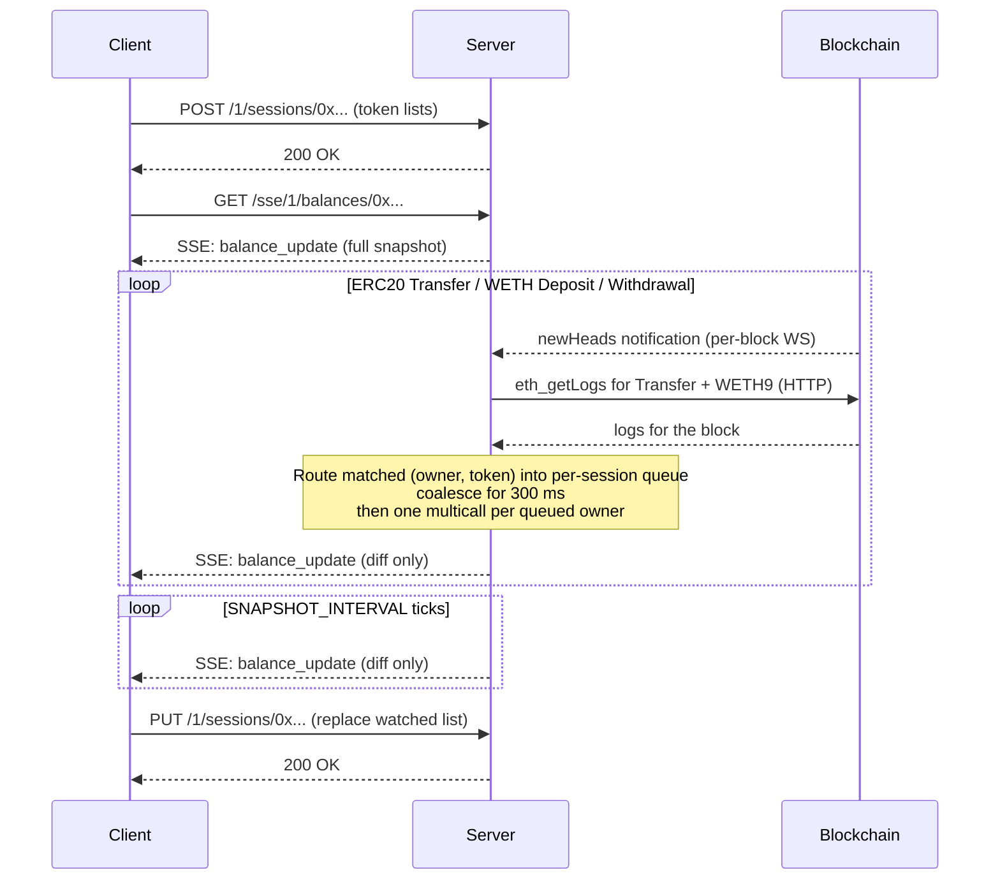
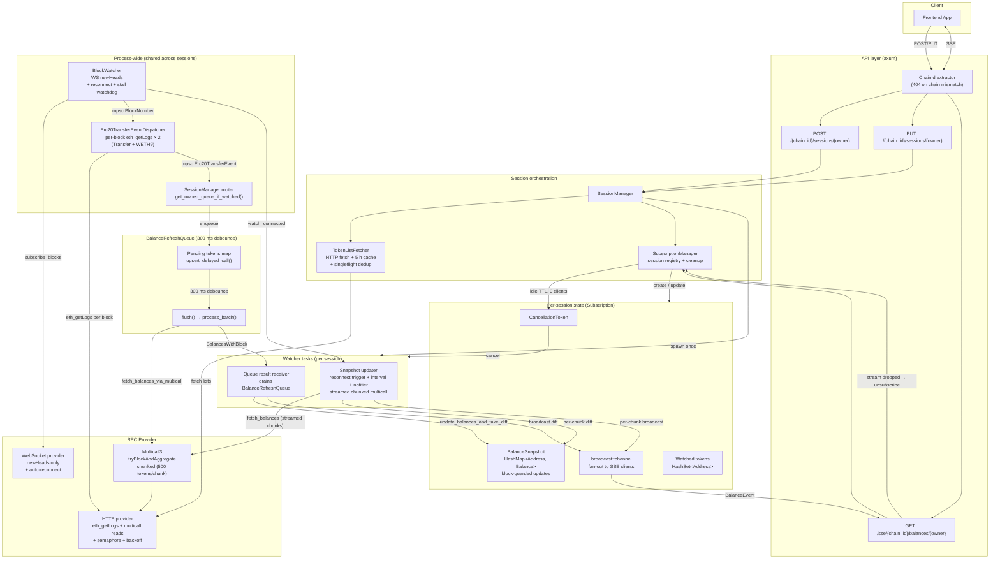

# Token Balances Watcher

Real-time **ERC20** balance tracking service for EVM chains, designed to back
the CoW Swap frontend without each user blowing through their wallet's RPC rate
limits.

> **Scope:** native balances (ETH on Ethereum, BNB on BSC, MATIC on Polygon, …)
> are **not** tracked. The native sentinel address `0xEee…EEeE` is silently
> dropped from the watched set if a client supplies it. Clients that need the
> native balance should query their wallet provider directly (`eth_getBalance`)
> — it is a single, cheap RPC call and does not benefit from this service's
> batching pipeline.

The service is **chain-scoped**: one process serves exactly one network. Multi-chain
coverage is achieved by running N replicas (one per chain) behind a path-based
ingress — see [Deployment model](#deployment-model).

## Features

- Real-time balance updates via **Server-Sent Events (SSE)**
- **Multicall3** for efficient batch balance reads (one `balanceOf` per watched
  token, chunked into ≤ 500-token batches and streamed back partial-first)
- **Chunked streaming initial snapshot** — first ~500 tokens land within
  seconds, the rest follow as their chunks complete; SSE clients see partial
  diffs immediately instead of waiting for the whole watched-list
- **Process-wide HTTP-pull event dispatcher** — a single
  `Erc20TransferEventDispatcher` runs one `eth_getLogs` per block for ERC20
  `Transfer` and WETH9 `Deposit`/`Withdrawal`, then fans matched
  `(owner, token)` pairs into per-session refresh queues. Cost is fixed per
  block regardless of active session count.
- **Event batching** via a 300 ms debounce queue — bursts of transfers collapse
  into a single multicall
- **Block-aware diffing** — stale updates can't overwrite fresher ones
- **Diff-only SSE events** after the initial snapshot (only changed balances are sent)
- **Shared subscriptions** — N SSE clients watching the same wallet pay for one
  set of background watchers
- **Block-lag health probe** — dispatcher goes unhealthy if it falls behind
  chain head by more than `MAX_BLOCK_LAG` blocks; block delivery uses a
  bounded FIFO channel with overflow detection
- **Token-list caching** with 5 h TTL + concurrent-request deduplication
- **Graceful shutdown** — `SIGTERM` cancels every spawned task via
  `CancellationToken`; in-flight work is awaited (up to 10 s) before exit
- **Prometheus metrics** exposed at `/metrics`

## Supported chains

`NETWORK` is set per instance to one of the chain ids below. The list matches
the EVM chains supported by the CoW SDK (`@cowprotocol/sdk-config` → `EvmChains`).

| Network | Chain id |
|---------|----------|
| Ethereum mainnet | `1` |
| BNB Smart Chain | `56` |
| Gnosis Chain | `100` |
| Polygon | `137` |
| Base | `8453` |
| Plasma | `9745` |
| Arbitrum One | `42161` |
| Avalanche | `43114` |
| Ink | `57073` |
| Linea | `59144` |
| Sepolia testnet | `11155111` |

RPC endpoints are configured per instance via `RPC_HTTP_URL` and `RPC_WS_URL`
environment variables. In production (CoW infrastructure), these point to
cluster-local RPC proxies (e.g. `http://mainnet-proxy.rpc-nodes.svc.cluster.local`).
For local development, any RPC provider (Alchemy, Infura, etc.) can be used.

## API

All API routes carry `{chain_id}` so the ingress can route by URL. Each instance
rejects requests addressed to a chain other than its configured `NETWORK` with
`404 Not Found` (enforced via the `ChainId` axum extractor).

### `POST /{chain_id}/sessions/{owner}` — create session

Must be called before opening the SSE stream. Spawns the per-session watchers
(snapshot updater, ERC20 listeners, WETH9 listener, queue receiver).

```bash
curl -X POST http://localhost:8080/1/sessions/0xd8dA6BF26964aF9D7eEd9e03E53415D37aA96045 \
     -H 'Content-Type: application/json' \
     -d '{
       "tokensListsUrls": ["https://tokens.coingecko.com/uniswap/all.json"],
       "customTokens": ["0xdAC17F958D2ee523a2206206994597C13D831ec7"]
     }'
```

| Status | Meaning |
|---|---|
| `200 OK` | Session created (or watched list replaced if it already existed) |
| `400 Bad Request` | Both `tokensListsUrls` and `customTokens` empty, or token limit exceeded |
| `404 Not Found` | `chain_id` does not match this instance's `NETWORK` |

### `PUT /{chain_id}/sessions/{owner}` — replace watched token list

Sets the session's watched token list to **exactly** the resolved list (token
lists + `customTokens` + WETH9). Tokens previously watched but absent from
the new request are dropped from the watched set, and their cached balance
entries are evicted so SSE clients stop receiving stale data for them.

The `400 Bad Request` token-limit check applies to the **new** list, not to
the union with the previous one — clients can freely rotate token lists
without hitting the limit as long as each individual request stays under it.

```bash
curl -X PUT http://localhost:8080/1/sessions/0xd8dA6BF26964aF9D7eEd9e03E53415D37aA96045 \
     -H 'Content-Type: application/json' \
     -d '{ "customTokens": ["0xNewTokenAddress"] }'
```

| Status | Meaning |
|---|---|
| `200 OK` | Watched list replaced |
| `400 Bad Request` | Body empty or new list exceeds token limit |
| `404 Not Found` | `chain_id` mismatch or session does not exist |

### `GET /sse/{chain_id}/balances/{owner}` — balance stream

Long-lived SSE stream. The first event is the full snapshot for all watched
tokens; every subsequent event is **only the changed balances** (a diff).

```bash
curl -N http://localhost:8080/sse/1/balances/0xd8dA6BF26964aF9D7eEd9e03E53415D37aA96045
```

```
event: balance_update
data: {"balances":{"0xToken1...":"1000000","0xToken2...":"500000"}}

event: error
data: {"code":503,"message":"WebSocket connection lost permanently"}
```

| Event | Meaning |
|---|---|
| `balance_update` | First message = full snapshot. All others = diffs only. Periodic snapshot refreshes also emit diffs. |
| `error` | Terminal error (RPC exhausted, server shutting down, ...). Client should reconnect. |

### `GET /health` — health probe

Returns `200 OK` iff **both** of the following are green:

1. **BlockWatcher liveness** — the process-wide `eth_subscribe("newHeads")`
   stream has produced at least one header since the last reconnect.
   Backed by an infinite-retry reconnect loop (exponential backoff 1 s → 30 s
   with jitter) and a stall watchdog (`block_time × 3`) that flips the flag
   red if no header arrives in the window.
2. **Event dispatcher lag** — the process-wide event dispatcher's
   `last_processed_block` is within `MAX_BLOCK_LAG` (5) of the chain head.
   Warm-up (no block seen yet, or no block processed yet) returns healthy
   to avoid flapping during initial multicall storm.

The handler is a pure atomic read — no RPC round-trip per probe. Both signals
are updated in the background: `BlockWatcher` on every incoming header,
dispatcher on every completed block.

Used by Kubernetes `readinessProbe` + `livenessProbe`.

```bash
curl -i http://localhost:8080/health
```

### `GET /openapi.json` and `GET /docs` — OpenAPI

The OpenAPI 3.1 spec is generated at compile time via [`utoipa`] from
`#[utoipa::path]` attributes on the handlers (see `src/api/openapi.rs`).

- `GET /openapi.json` — raw spec, suitable for codegen / API clients.
- `GET /docs` — Swagger UI for interactive exploration, served by
  [`utoipa-swagger-ui`].

No external API portal — the service hosts both endpoints directly because it
is internal-use only.

[`utoipa`]: https://crates.io/crates/utoipa
[`utoipa-swagger-ui`]: https://crates.io/crates/utoipa-swagger-ui

### `GET /metrics` — Prometheus

Standard scrape endpoint, exposes counters / gauges / histograms for sessions,
SSE connections, multicall latency, WS reconnects, broadcast lag, and more.
All handles are pre-registered at startup via `src/metrics.rs` (typed
`Counter` / `Gauge` / `Histogram` struct — no string-based macros at call
sites).

### Error response shape

All `4xx`/`5xx` API responses use the same JSON envelope:

```json
{ "code": 400, "message": "Bad request: tokens_lists_urls && custom_tokens are empty" }
```

## Usage flow



## Architecture



## Deployment model

Each chain runs as its own process. Benefits over the old multi-chain-in-one-process
model:

- **Fault isolation** — a Polygon hardfork or RPC outage on one chain can't
  exhaust resources or fail readiness on the others.
- **Independent rollouts** — version one chain at a time.
- **Per-chain config** — separate RPC endpoints, rate-limit tiers, resource
  requests, Prometheus pod labels.

### Kubernetes (production)

Deployed via [cowprotocol/infrastructure](https://github.com/cowprotocol/infrastructure)
using Pulumi (DNS, secrets) + Flux (k8s manifests). One `Deployment` + `Service`
per chain in the `balances-watcher` namespace, with a shared `Ingress` routing
`/<chain_id>/...` and `/sse/<chain_id>/...` to the matching service.

Docker images are built and pushed to GHCR by `.github/workflows/build-image.yml`
on push to `main` or on semver tags (`vX.Y.Z`). Flux picks up new image tags
from `ghcr.io/cowprotocol/balances-watcher`.

### Releases

Versioning is fully automatic. Every merge to `main` triggers the `release` job
which bumps the minor version from the latest git tag (`v0.1.0` → `v0.2.0` → …)
and pushes the new tag. The tag push re-triggers the build pipeline, producing
a GHCR image tagged with the semver version (`v0.2.0`, `0.2`) alongside `sha-xxx`
and `latest`.

### docker-compose (local dev)

`docker-compose.yml` mirrors the production layout: one Traefik service in front
of `balances-watcher-eth`, `-arb`, `-sepolia`. All three reachable through a
single host port (`localhost:4000`) using the same URL shape as production.

```bash
# RPC URLs are set per service in docker-compose.yml.
# By default they fall back to Alchemy via ALCHEMY_API_KEY from .env.
# Override per chain: ETH_RPC_HTTP_URL, ARB_RPC_HTTP_URL, etc.
docker-compose up -d --build

# Traefik dashboard for routing introspection
open http://localhost:8081

curl -X POST http://localhost:4000/1/sessions/0xd8dA... -d '{...}'
curl -N      http://localhost:4000/sse/1/balances/0xd8dA...
```

## Environment variables

| Variable | Description | Default |
|----------|-------------|---------|
| `NETWORK` | **Required.** Chain id this instance serves. Validated at args-parse time via `EvmNetwork::FromStr`. | — |
| `RPC_HTTP_URL` | **Required.** HTTP RPC endpoint (e.g. `https://eth-mainnet.g.alchemy.com/v2/KEY` or `http://mainnet-proxy.rpc-nodes.svc.cluster.local`). | — |
| `RPC_WS_URL` | **Required.** WebSocket RPC endpoint (e.g. `wss://eth-mainnet.g.alchemy.com/v2/KEY` or `ws://mainnet-proxy.rpc-nodes.svc.cluster.local`). | — |
| `HTTP_BIND` | Bind address. | `0.0.0.0:8080` |
| `SNAPSHOT_INTERVAL` | Full multicall refresh interval, seconds. | `60` |
| `MAX_WATCHED_TOKENS_LIMIT` | Max tokens per session. | `1500` |
| `RUST_LOG` | Standard `tracing-subscriber` env-filter. | unset |

## Quick start

### `cargo run`

```bash
export NETWORK=1
export RPC_HTTP_URL=https://eth-mainnet.g.alchemy.com/v2/YOUR_KEY
export RPC_WS_URL=wss://eth-mainnet.g.alchemy.com/v2/YOUR_KEY

cargo run --release
```

### docker-compose

```bash
# put ALCHEMY_API_KEY=... in .env (used as fallback in compose per-chain URLs)
# or set per-chain vars directly: ETH_RPC_HTTP_URL, ETH_RPC_WS_URL, etc.
docker-compose up -d --build
docker-compose logs -f
```

## Limits & internal tunables

Compile-time in `src/config/constants.rs` (and a few module-local `const`s):

| Limit | Value | Description |
|-------|-------|-------------|
| Max tokens per session | `1500` | Session is rejected if total watched tokens exceeds this. |
| Token list cache TTL | `5 h` | HTTP fetches dedup'd via singleflight + cached. |
| Session idle TTL | `5 s` | Sessions with no SSE clients are cancelled after this idle window. |
| Broadcast channel capacity | `256` | Per-subscription buffer of pending events. |
| Calls-queue debounce | `300 ms` | Window over which transfer events coalesce into a single multicall. |
| Multicall concurrency | `300` permits | Semaphore around concurrent multicall requests. |
| Multicall chunk size | `500` tokens | Watched list is split into chunks of this size for streaming. |
| Block channel capacity | `256` | Bounded FIFO from `BlockWatcher` → `Erc20TransferEventDispatcher`; overflow drops + logs error + increments a counter. |
| Max dispatcher lag | `5` blocks | `/health` flips red if the dispatcher is more than this many blocks behind the chain head after warm-up. |
| BlockWatcher stall timeout | `block_time × 3` | Forces a fresh WS subscription if no header arrives in this window. |

## On-chain events watched

| Event | Contract | Triggers |
|---|---|---|
| `Transfer(from indexed, to indexed, value)` | any ERC20 emitting this event | balance refresh for matched `(owner, token)` |
| `Deposit(dst indexed, wad)` | WETH9 | balance refresh for WETH |
| `Withdrawal(src indexed, wad)` | WETH9 | balance refresh for WETH |

**Delivery** is HTTP-pull, not WS-push. On every new `newHeads`
notification (delivered via the process-wide `BlockWatcher`), the shared
`Erc20TransferEventDispatcher` runs exactly two `eth_getLogs` calls for that
block:

- **ERC20 Transfer** — `topics[0] = Transfer::SIGNATURE_HASH`, no address
  filter (global). Client-side we route each log by `from` / `to` into the
  matching session's queue via
  `SubscriptionManager::get_owned_queue_if_watched(owner, token)`. Logs for
  owners / tokens not in any watched set are dropped in-process.
- **WETH9 Deposit / Withdrawal** — filtered node-side by `address = weth9`
  and both event signatures. Canonical WETH9 does **not** emit a `Transfer`
  on `deposit()` / `withdraw()`, so wrap/unwrap would be invisible to the
  global Transfer path.

This gives 100 % delivery (`eth_getLogs` returns the full set for the block,
unlike WS subscriptions that silently drop tail events during block bursts)
and fixed cost per block (two HTTP RPCs / ~12 s on mainnet) regardless of
active session count.

## Project structure

```
src/
├── main.rs                 entry point — args, tracing, Metrics::install, AppState, axum::serve
├── args.rs                 clap Args (env → typed; NETWORK parsed via EvmNetwork::FromStr)
├── app_state.rs            owns Arc<SessionManager> + Arc<Metrics> + network
├── app_error.rs            HTTP error type (NotFound / BadRequest → JSON body)
├── metrics.rs              typed Counter / Gauge / Histogram handles, pre-registered at startup
│
├── api.rs                  umbrella: declares the handlers below, builds the Router
├── api/
│   ├── create_session.rs   POST /{chain_id}/sessions/{owner}
│   ├── update_session.rs   PUT  /{chain_id}/sessions/{owner}
│   ├── create_sse_session.rs  GET /sse/{chain_id}/balances/{owner}
│   ├── health.rs           GET /health — reads BlockWatcher::is_healthy()
│   └── extractors.rs       ChainId — validates {chain_id} against AppState::network
│
├── config/
│   ├── constants.rs        compile-time tunables
│   ├── network_config.rs   NetworkConfig::from_args (RPC URLs from env)
│   └── back_off_config.rs  backon::ExponentialBuilder presets
│
├── domain/
│   ├── evm_network.rs      EvmNetwork enum + FromStr / TryFrom<u64> + per-chain WETH9
│   ├── session.rs          Session = (owner, network)
│   ├── events.rs           BalanceEvent for SSE
│   ├── token.rs            Token (chain_id + address)
│   └── errors.rs           EvmError
│
├── evm/                    alloy sol! bindings
│   ├── erc20.rs            ERC20 Transfer
│   └── wrapped.rs          WETH9 Deposit / Withdrawal
│
├── services/
│   ├── block_watcher.rs    process-wide WS newHeads subscription; backs /health via is_healthy(); fans block numbers into a bounded FIFO consumed by the dispatcher
│   ├── event_dispatcher.rs process-wide Erc20TransferEventDispatcher: per-block eth_getLogs (Transfer + WETH9 Deposit/Withdrawal), fans matched (owner, token) events into per-session queues
│   ├── session_manager.rs  per-network orchestrator: token lists, watchers, SSE bridge, dispatcher router
│   ├── subscription_manager.rs  session registry, shared subs, idle cleanup
│   ├── subscription.rs     per-session state (snapshot, broadcast, watched set)
│   ├── snapshot_updater.rs spawns 2 background tasks per session (snapshot updater — streamed chunked multicall + queue result receiver)
│   ├── balance_refresh_queue.rs  BalanceRefreshQueue: 300 ms debounce + coalesce-by-token
│   ├── rpc_client.rs       HTTP RPC client: multicall (chunked streaming + all-or-nothing paths) + log fetches for the dispatcher
│   ├── token_list_fetcher.rs  HTTP + cache + singleflight dedup
│   └── cleanup_stream.rs   Drop guard that unsubscribes when SSE stream is dropped
│
├── graceful_shutdown/      SIGTERM → CancellationToken
└── tracing/                tracing-subscriber init (JSON layer)
```

## License

MIT
